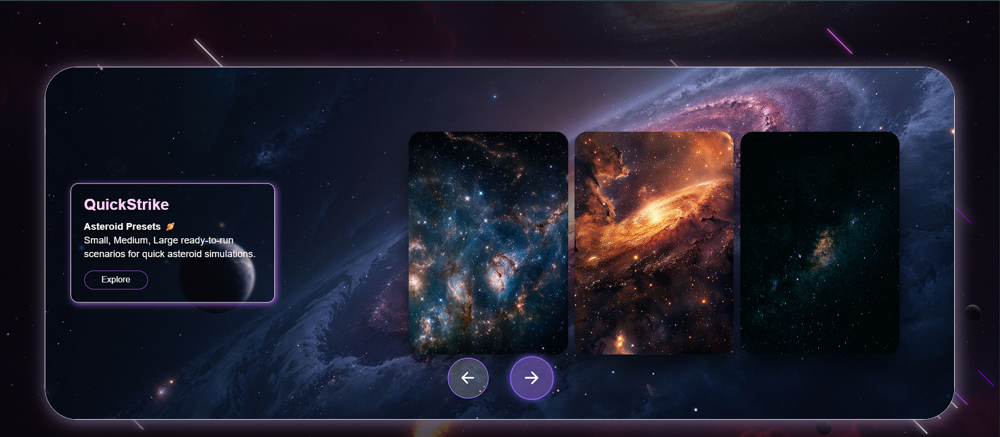
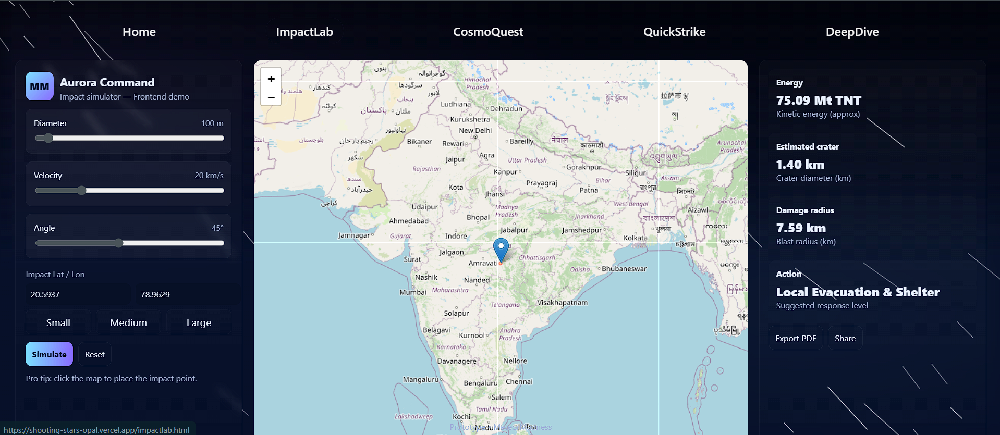
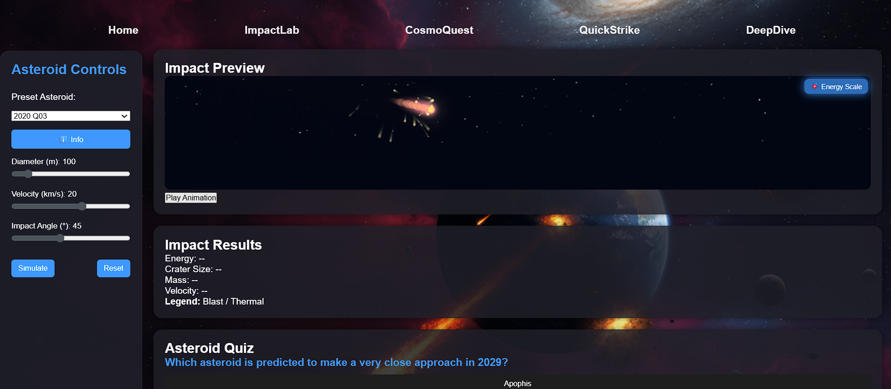

# 🌠 ShootingStars – Asteroid Impact Simulator & Space Explorer

An interactive web app that lets users **simulate asteroid impacts, explore cosmic trajectories, and learn about meteor showers and comets**. This website features asteroid presets, custom input controls, impact preview cards, quizzes, info modals, and detailed results panels — all wrapped in a cosmic, educational, and visually appealing interface.

---

## 🎯 Project Objective

To create a **fully interactive, responsive, and educational front-end web app** that allows users to explore asteroid impacts, experiment with trajectories, and understand cosmic events — without any backend, using only HTML, CSS, and JavaScript.

---

## 🚀 Live Demo

🔗 [Visit the Website](shooting-stars-opal.vercel.app)  

---

## 🖥️ Tech Stack

- HTML5 + CSS3 + JavaScript (ES6)  
- Local animations and interactive elements  
- Fully front-end modular structure  
- No backend or database required  

---

## 🌟 Features

###  *QuickStrike*
- 🪐 Asteroid Presets
- Predefined small, medium, and large asteroid scenarios  
- Quick simulations with realistic impact effects    

### *Impact Designer*  
- 🎛️ Custom Input Controls
- Interactive sliders for diameter, velocity, impact angle, latitude, and longitude  
- Fine-tune asteroid parameters for precise simulations  

### *MiniBlast* 
- 🎬 Impact Preview Card
- Miniature canvas previews of asteroid strikes  
- Energy scale visualization for quick insights   

### *SpaceQuest* 
- 🧩 Asteroid Quiz
- Test your knowledge about space and asteroid impacts  
- Dynamic Next/Previous navigation for smooth learning  

### *DeepDive*
- ℹ️ Info Modal
- Pop-up modal with additional asteroid details  
- Explore mass, composition, velocity, and impact information  

### *AstroMetrics* 
- 📊 Results & Legends Panel
- Displays energy released, crater size, mass, velocity, and blast/thermal legends  
- Color-coded visual representation for easy understanding  

---

## 📸 Screenshots

### Homepage


### ImpactLab Simulation


### CosmoQuest Quiz


### Asteroid Preview & Results


### Info Modal


## 📁 Folder Structure

```
shootingstars/
├── index.html # Homepage
├── style.css
├── script.js
├── impactlab.html # ImpactLab simulations
├── impactlab.css
├── impactlab.js
├── cosmoquest.html # Quiz & exploration
├── cosmoquest.css
├── cosmoquest.js
├── images
└── README.md # This file
```


> ✅ Each page has modular CSS and JS for easier maintenance and scalability.

---

## ⚙️ Setup Instructions

### 1. Clone the Repository

```bash
git clone https://github.com/<your-username>/shootingstars.git
cd shootingstars
```

### 2. Open Locally
Option 1: Open index.html in your browser
Option 2: Use Live Server for live preview:
```bash
npm install -g live-server
live-server
```

### 3. Deploy on Vercel

- Push your repo to GitHub
- Go to Vercel → New Project → Import Git Repository
- Framework: Other (HTML/CSS/JS)
- Root Directory: /
- Click Deploy → your site will be live at 🔗 https://shootingstars.vercel.app

---

## 👥 Contributors

| Name | Role |
|------|------|
| @aadya2901 | Homepage, Landing Page, Deployment    |
| @iam-anish15 | Homepage, Navbar, Footer, Carousel  |
| @ananyamishra13 | ImpactLab, CosmoQuest, MiniBlast |

---

## 🤝 Contributing

We welcome contributions, improvements, and bug fixes:

1. Fork the project  
2. Create your feature branch (`git checkout -b feature/YourFeature`)  
3. Commit your changes (`git commit -m 'Add your feature'`)  
4. Push to the branch (`git push origin feature/YourFeature`)  
5. Open a Pull Request  

---

## 📝 License

This project is open source under the **MIT License**. Use it for personal or educational purposes.  

---

## 💬 Final Note

*"Exploring the cosmos one asteroid at a time!"* 🚀

